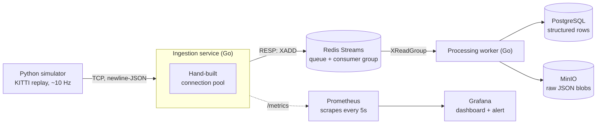

# Event Telemetry Pipeline

A high-throughput ingestion pipeline for autonomous-vehicle sensor telemetry, built around a
**hand-written TCP connection pool**. It replays real GPS/IMU sensor data recorded by an actual
autonomous-driving research vehicle (KITTI), ingests it through a Go service, queues it with
Redis Streams, and persists it to PostgreSQL and object storage — with full observability, a
proven-firing alert, load testing, a chaos-recovery scenario, and a working Kubernetes
deployment.

**At a glance:**

| | |
|---|---|
| **Throughput** | ~55K events/sec pooled, p99 <2ms — **~7×** a fresh connection per event |
| **Resilience** | Worker killed mid-processing → **zero data loss**, automatic replay |
| **Observability** | Real Prometheus + Grafana alert, **proven firing** under genuine pool saturation |
| **Deployment** | Runs on `docker compose up`, and on a real self-healing **Kubernetes** cluster |

*Every number above is measured firsthand, from this repo — see [Results](#results).*

## Contents

- [The problem](#the-problem)
- [The solution](#the-solution)
- [Why real sensor data, and why not Tesla's](#why-real-sensor-data-and-why-not-teslas)
- [Architecture](#architecture)
- [Tech stack](#tech-stack)
- [Quick start](#quick-start)
- [Results](#results)
- [Kubernetes](#kubernetes)
- [Status](#status)
- [Future work](#future-work)

---

## The problem

Autonomous-driving systems emit sensor telemetry continuously and at high frequency.
Ingesting that stream naively — opening a fresh network connection for every event —
does not scale:

- **Connection setup is expensive.** Every new TCP connection costs a full handshake
  round-trip before a single byte of data moves. At high event rates, this setup cost
  dominates and throughput collapses.
- **Connections are a finite resource.** Each open connection consumes a file
  descriptor and kernel memory on both ends. Unbounded connection growth exhausts
  those resources and takes the service down.

The result is a system that is both slow and fragile under exactly the load it was
built to handle.

## The solution

A **connection pool implemented from scratch** — no ORM, no `database/sql`-style
abstraction, just the primitives. The pool maintains a bounded set of established
connections and hands them out on demand:

- **Amortized setup cost** — the handshake is paid once per pooled connection, then
  reused across many events instead of once per event.
- **Bounded resource usage** — the pool caps the number of live connections by design,
  so file-descriptor and memory usage can never run away.
- **Explicit backpressure** — when every connection is in use, the pool applies a
  defined policy (wait, then time out) rather than failing unpredictably — measured
  under real load, not just assumed. See [Results](#results).

This pool is the core of the system; the surrounding components are intentionally kept
straightforward so the pool's behavior is easy to reason about.

## Why real sensor data, and why not Tesla's

The telemetry replayed here is **KITTI** — real, recorded GPS/IMU (OXTS) readings from an
actual autonomous-driving research vehicle (Karlsruhe Institute of Technology), not synthetic
or fabricated data. Every field the pipeline moves — latitude, longitude, speed, acceleration,
yaw rate, satellite count — is a real sensor reading from a real car that really drove around.

To be precise about what this is and isn't: **this is not Tesla's data**, and the pipeline
doesn't claim to be Tesla's system. It's the same *shape* of pipeline a company like Tesla,
Waymo, or Cruise runs internally — real GPS/IMU telemetry from a real vehicle, ingested
reliably at scale, without dropping data or falling over under load — built on public, honest
data rather than anything proprietary.

## Architecture



| Component | Role |
|---|---|
| **KITTI replay simulator** (Python) | Replays real recorded AV sensor data as a live stream, at the dataset's real ~10 Hz cadence. |
| **Ingestion service** (Go) | Receives the stream through the hand-built pool; speaks Redis's wire protocol (RESP) directly on this path — no client library. |
| **Redis Streams** | Durable queue decoupling ingestion from processing; consumer groups + acknowledgment mean a worker crash mid-processing loses nothing. |
| **Processing worker** (Go) | Persists each event to **both** PostgreSQL (structured, queryable) and object storage (untouched raw JSON) — the data-lake pattern. |
| **Prometheus + Grafana** | Scrapes pool metrics (connections in use, acquires, acquire timeouts) into durable history, on a 3-panel dashboard, with an alert **proven to actually fire** against real, deliberately-induced saturation. |
| **Kubernetes** | The same 7-service pipeline also runs on a real 3-node cluster (`kind`) — self-healing, Secrets, ConfigMaps — proven end-to-end. |

## Tech stack

Go · Python · Redis Streams · PostgreSQL · MinIO (S3-compatible) · Prometheus · Grafana ·
Docker · Kubernetes

---

## Quick start

```bash
git clone <this-repo>
cd event-telemetry-pipeline
docker compose up -d --build
python3 simulator/simulator.py
```

That's it — real KITTI telemetry starts flowing through the whole pipeline. While it runs:

- **Grafana:** [localhost:3000](http://localhost:3000) (`admin` / `admin`) — pool utilization dashboard
- **Prometheus:** [localhost:9090](http://localhost:9090) — raw metrics + alert status
- **MinIO console:** [localhost:9101](http://localhost:9101) — raw event blobs
- **Postgres:** `localhost:5434`, db `telemetry` — structured event rows

## Results

Real numbers, measured firsthand — every one reproducible from this repo.

- **Throughput/latency** (custom Go load generator, [`ingestion/loadtest/`](ingestion/loadtest/) —
  not k6, since the ingestion service speaks raw TCP/RESP, not HTTP): pooled connections
  sustained **~55K events/sec at p99 <2ms**, **~7×** the throughput of dialing a fresh
  connection per event. Per-dial mode also **collapsed under sustained load from
  ephemeral-port exhaustion** — a live demonstration of exactly why connection pools exist.
- **Chaos recovery:** killed the worker mid-processing; Redis Streams' consumer-group
  pending list held the in-flight events; on restart, the worker replayed exactly those
  events and resumed — **zero data loss**, at-least-once delivery.
- **Pool saturation → real alert firing:** deliberately shrank the live pool (via
  configurable `POOL_SIZE`/`ACQUIRE_TIMEOUT_MS`) and hammered it with 50 concurrent
  unpaced connections; produced real acquire timeouts on the running service, watched
  `pool_acquire_timeouts_total` climb in Grafana, and watched the alert rule
  (`increase(pool_acquire_timeouts_total[1m]) > 0`) transition to **Firing** — not just
  configured, actually proven under genuine contention.
- **Kubernetes self-healing:** deleted a running Pod directly; the Deployment noticed and
  replaced it automatically (new Pod, new IP, even a different node) while the Service's
  address never changed — proven live, not just described.

See [`docs/`](docs/) for the full dated build history and the reasoning behind every decision.

## Kubernetes

The full pipeline also runs on a real, self-healing 3-node Kubernetes cluster (built with
`kind`, Docker Desktop's Kubernetes-in-Docker option):

```bash
kubectl apply -f k8s/
kubectl get pods -o wide     # all 7 services, spread across 2 worker nodes
kubectl port-forward svc/ingestion 9000:9000
python3 simulator/simulator.py   # same simulator, now flowing through the cluster
```

Credentials for Postgres/MinIO are pulled from `kubectl create secret` — never committed to
git — via `valueFrom.secretKeyRef` in the manifests. See
[`docs/concepts.md`](docs/concepts.md) for the full Kubernetes write-up: Node/Pod/Deployment/
Service, Secrets vs. ConfigMaps, how a locally-built image reached the cluster, and
`kubectl port-forward` vs. the real production alternatives (`LoadBalancer`, `Ingress`).

## Status

Feature-complete: the pipeline, the hand-built pool, load testing, observability with a
proven-firing alert, chaos recovery, and a working Kubernetes deployment are all built and
verified. See [`docs/progress-log.md`](docs/progress-log.md) for the complete, dated build
history.

## Future work

Scope intentionally bounded for this iteration:

- **Kafka** for the queue layer — Redis Streams is simpler and enough at this scale (see
  [design-decisions.md](docs/design-decisions.md)).
- **GPU-accelerated processing**, **CARLA-based simulation** — out of scope; real recorded
  KITTI data was the deliberate, more honest choice over a full driving simulator.
- **A real container registry + `LoadBalancer`/`Ingress`** — the Kubernetes deployment
  currently relies on Docker Desktop's local image sharing and `kubectl port-forward` for
  external access, both genuine local-development shortcuts; a real multi-machine cluster
  would need a pushed image and a permanent external access method instead.
- **`PersistentVolume`s for Prometheus/Grafana in Kubernetes** — currently only the
  Docker Compose versions have durable storage for their data.
- **Terraform-managed cloud deployment**, **a custom load balancer**, **additional chaos
  scenarios**, **idempotent event processing** (dedup for the at-least-once delivery
  model's rare duplicate case) — deliberately out of scope to stay focused.
